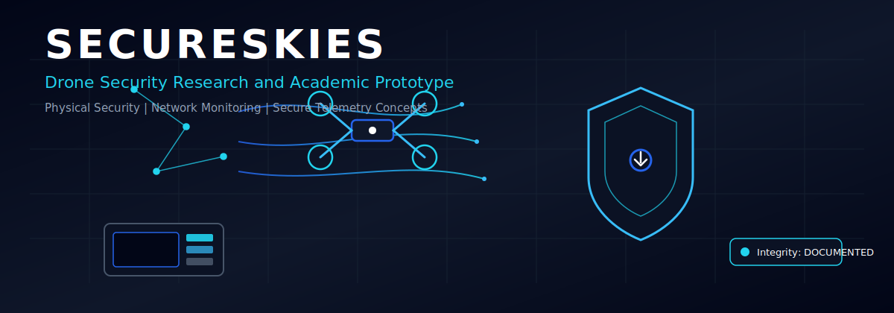
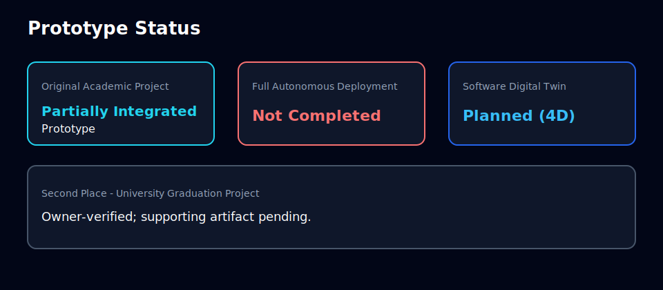
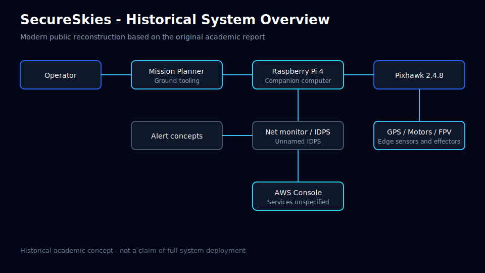
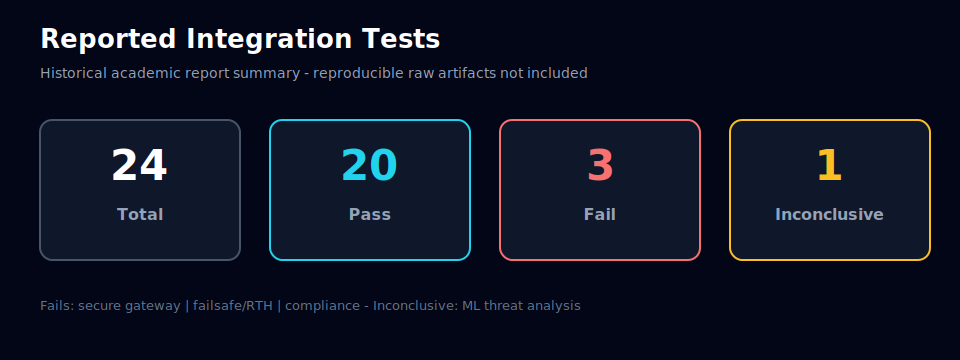

# SecureSkies

  <picture>
    <source media="(prefers-reduced-motion: reduce)" srcset="./assets/secureskies-static-banner.svg" />
    
  </picture>

**Academic graduation project · Sanitized public historical portfolio**

| Field | Value |
|-------|-------|
| Status | Documentation foundation (MGH.GITHUB.ECOSYSTEM.4C) |
| Achievement | **Second Place — University Graduation Project** · Owner-verified; supporting artifact pending. |
| Team | Saud F. Alsawaihan · Muhanad Ghurab · Abdullah Shukri · Abdulaziz Alenizi |
| Supervisor | Dr. Muhammad Ishaq |
| Institution | Jeddah International College — Computer Science and Information Technology Department |
| Report date | May 2024 |
| Repository scope | Historical summaries, original diagrams, modern planning — **no raw academic PDF** |

---

## Historical vs modern

| Layer | Meaning |
|-------|---------|
| **A. Historical academic project** | Material derived from the original 2024 university report (sanitized) |
| **B. Modern portfolio development** | New diagrams, security analysis, and digital-twin planning produced after graduation |

This distinction applies across README and all docs under `docs/original/` vs `docs/modern/`.

---

## Project status panel

| Area | Status |
|------|--------|
| Original Academic Project | Partially Integrated Prototype |
| Full Autonomous Deployment | Not Completed |
| Historical Documentation | Complete |
| Modern Security Review | Foundation |
| Software Digital Twin | Planned for MGH.GITHUB.ECOSYSTEM.4D |
| Second Place | Owner-verified; supporting artifact pending |

  

---

## Project summary

SecureSkies was a **four-person** university graduation project exploring a drone-based
security system that combined physical perimeter monitoring, live surveillance concepts,
network monitoring, security alerting, Raspberry Pi processing, Pixhawk flight control,
and cloud-connected concepts.

The project reached a **partially integrated prototype stage**.

Major hardware and software components were assembled and tested, but the **full
autonomous, secure, cloud-connected system was not completed** within the project
timeline and available resources.

Start here: [`docs/START-HERE.md`](docs/START-HERE.md) · Status detail: [`docs/PROJECT-STATUS.md`](docs/PROJECT-STATUS.md)

---

## Emerging systems pack (MGH.PROGRAM.EMERGING.1)

| Doc | Purpose |
|-----|---------|
| [`docs/emerging/README.md`](docs/emerging/README.md) | Pack index and boundaries |
| [`docs/emerging/DRONE-SECURITY-CASE-STUDY.md`](docs/emerging/DRONE-SECURITY-CASE-STUDY.md) | Sanitized security case study |
| [`docs/emerging/OT-IOT-THREAT-SURFACE.md`](docs/emerging/OT-IOT-THREAT-SURFACE.md) | Adjacent OT/IoT thinking |
| [`docs/emerging/RESPONSIBLE-AI-NOTES.md`](docs/emerging/RESPONSIBLE-AI-NOTES.md) | Responsible AI / autonomy honesty |
| [`docs/emerging/OWNERSHIP-BOUNDARY-CHECKLIST.md`](docs/emerging/OWNERSHIP-BOUNDARY-CHECKLIST.md) | Publication gate checklist |

---

## Team

See [`TEAM.md`](TEAM.md).

- Saud F. Alsawaihan
- Muhanad Ghurab
- Abdullah Shukri
- Abdulaziz Alenizi

**Supervisor:** Dr. Muhammad Ishaq  

**Institution:** Jeddah International College — Computer Science and Information Technology Department

Student IDs are not published. Individual technical roles are not assigned.

---

## Verified achievement

**Second Place — University Graduation Project**

Owner-verified; supporting artifact pending.

Do not describe the project as award-winning without this qualifier.

---

## Problem and vision

The original project addressed:

- Physical perimeter risks and unauthorized access concerns
- Cybersecurity monitoring needs alongside physical coverage
- Cost and coverage challenges of siloed controls
- An integrated physical + cyber defense concept using an onboard companion computer and flight controller

This documentation uses restrained academic language, not product marketing.

Details: [`docs/original/PROBLEM-AND-OBJECTIVES.md`](docs/original/PROBLEM-AND-OBJECTIVES.md)

---

## Original architecture

Historical concept stack:

- Raspberry Pi 4 (companion computer)
- Pixhawk 2.4.8 (flight controller)
- Mission Planner
- GPS
- FPV camera
- Telemetry radio
- AWS Console concepts (services unspecified in the report)
- Network monitoring (Wireshark / tcpdump)
- Alert management concepts
- Operator interface concepts (mockups; not a final product)

Full diagrams: [`docs/original/ARCHITECTURE.md`](docs/original/ARCHITECTURE.md)

  

---

## Hardware

| Component | Public status |
|-----------|---------------|
| F450-class frame | Reported / assembled |
| Raspberry Pi 4 Model B | Reported / integrated / tested |
| Pixhawk 2.4.8 | Reported / integrated; failsafe validation failed |
| 2212 920KV motors (4) | Reported / connected in FC tests |
| BLHELI 30A ESCs (4) | Reported / hardware integration tested |
| 1045 propellers | Reported / assembled |
| M8N GPS | Reported / calibration claimed |
| 433 MHz telemetry radio | Reported; gateway integration failed elsewhere |
| FPV camera | Reported integrated; “4K” historically claimed — independent verification unavailable |
| Power module / power bank | Reported |
| Safety button, buzzer, OLED, expansion peripherals | Reported |

Full inventory: [`docs/original/HARDWARE.md`](docs/original/HARDWARE.md)

---

## Software

| Tool | Notes |
|------|-------|
| Raspberry Pi OS | Companion OS — reported installed/tested |
| Mission Planner | Flight config / monitoring — reported tested |
| PuTTY | Remote access — reported |
| Wireshark / tcpdump | Network monitoring on RPi — reported pass |
| AWS Console | Cloud concepts — services **not named** |
| IDPS (unnamed) | Integration claimed — **do not invent product name** |
| Raspberry Pi CLI | Report wording “Raspberry Pi API” describes the **command-line environment** |

Details: [`docs/original/SOFTWARE.md`](docs/original/SOFTWARE.md)

---

## Requirements

Original requirements are **targets**, not completed features.

| Bucket | Examples |
|--------|----------|
| Original requirements | Autonomy, video, waypoints, network monitoring, alerts, cloud concepts, failsafe |
| Delivered evidence | Partial tooling/integration evidence across several FR areas |
| Incomplete / unverified | Obstacle avoidance not implemented as capability; media/battery UI designed only; failsafe/gateway/compliance failed tests |

Trace: [`docs/original/REQUIREMENTS.md`](docs/original/REQUIREMENTS.md)

---

## Testing

  

| Metric | Value |
|--------|------:|
| Total reported test items | 24 |
| Reported pass | 20 |
| Reported fail | 3 |
| Reported inconclusive | 1 |

**Failed areas include:**

- Secure low-latency communication gateway
- Failsafe / return-to-home behavior
- Compliance or best-practice validation

**Inconclusive:**

- Real-time machine-learning threat analysis

The report did not include reproducible raw logs, packet captures, or source artifacts
for independent retesting.

Full record: [`docs/original/TESTING.md`](docs/original/TESTING.md)

---

## Outcome and lessons

The team assembled major airframe, companion-computer, flight-controller, and monitoring
elements; practiced integration testing; and documented architecture and interface
concepts. Full deployment fell short due to integration complexity, vendor and
acquisition delays, time/budget limits, and project-management/resourcing constraints.

Lessons emphasize early architecture validation, clearer vendor coordination, and stronger
planning for specialist skills.

More: [`docs/original/OUTCOME-AND-LESSONS.md`](docs/original/OUTCOME-AND-LESSONS.md) ·
[`docs/original/LIMITATIONS.md`](docs/original/LIMITATIONS.md)

---

## Modernization

Future (post-graduation) portfolio work proposes:

- Modular architecture
- Device identity and mutual authentication
- Secure telemetry, message integrity, replay protection
- Access control and audit logging
- Safety and privacy boundaries
- Local simulation and threat modeling

These are **modern proposals**, not original 2024 deliverables.

See [`docs/modern/`](docs/modern/) — digital twin implementation is deferred to **4D**.

---

## Roadmap

| Milestone | Focus |
|-----------|-------|
| **4C** (this repo) | Public historical documentation |
| **4D** | Software-only SecureSkies digital twin |
| **4E** | Local dashboard and threat-model validation |
| **4F** | Verified historical evidence pack |
| **4G** | Hardware revisit planning (only after safety and regulatory approval) |

---

## Interview and CV

- [`docs/portfolio/INTERVIEW-WALKTHROUGH.md`](docs/portfolio/INTERVIEW-WALKTHROUGH.md)
- [`docs/portfolio/CV-PROJECT-SUMMARY.md`](docs/portfolio/CV-PROJECT-SUMMARY.md)
- [`docs/original/ARCHITECTURE.md`](docs/original/ARCHITECTURE.md)
- [`docs/original/TESTING.md`](docs/original/TESTING.md)
- [`docs/original/OUTCOME-AND-LESSONS.md`](docs/original/OUTCOME-AND-LESSONS.md)
- [`docs/modern/DIGITAL-TWIN-PLAN.md`](docs/modern/DIGITAL-TWIN-PLAN.md)

---

## Safety and privacy

- No real drone control in this repository
- No live camera or surveillance deployment
- No facial recognition
- No network scanning tooling shipping here
- No airworthiness or regulatory approval claim
- No production security product claim
- No original academic PDF publication
- No student identifiers

Boundaries: [`docs/PUBLICATION-BOUNDARIES.md`](docs/PUBLICATION-BOUNDARIES.md) · [`SECURITY.md`](SECURITY.md)

---

## Contact

**Muhanad Ghurab** — public repository maintenance  

- GitHub: https://github.com/MuhanadGhurab  
- LinkedIn: https://www.linkedin.com/in/muhanad-ghurab-141btb414  
- Email: muhanadghurab@gmail.com  

The original academic project belonged to the **full four-person team**.
