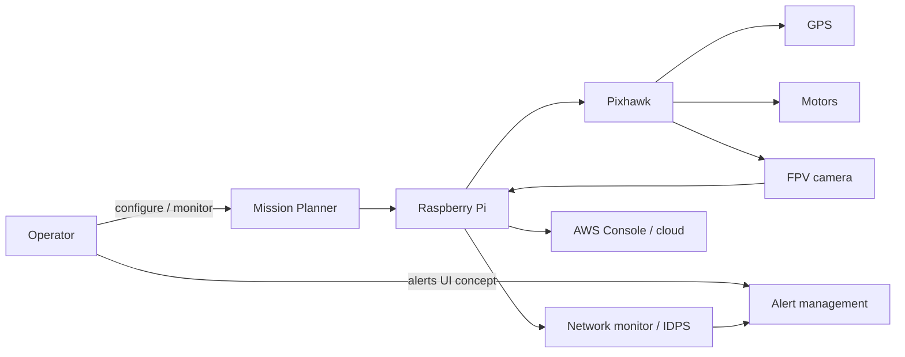
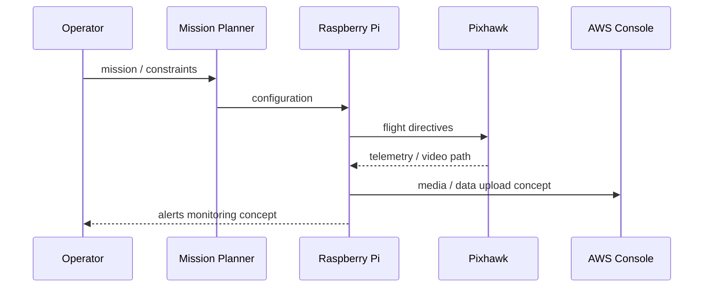
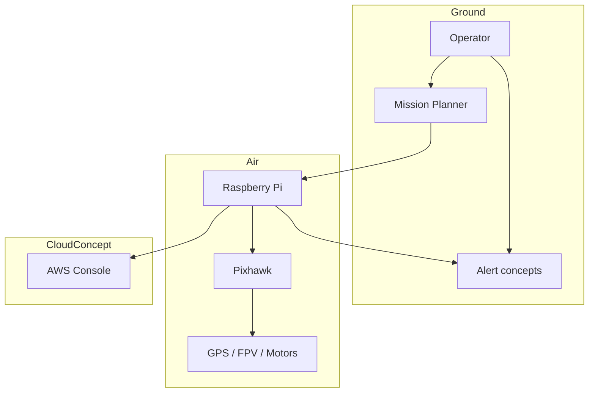
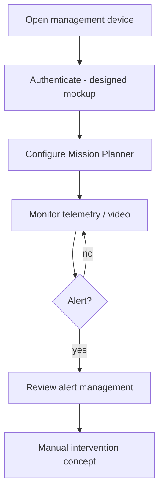
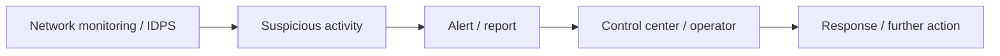
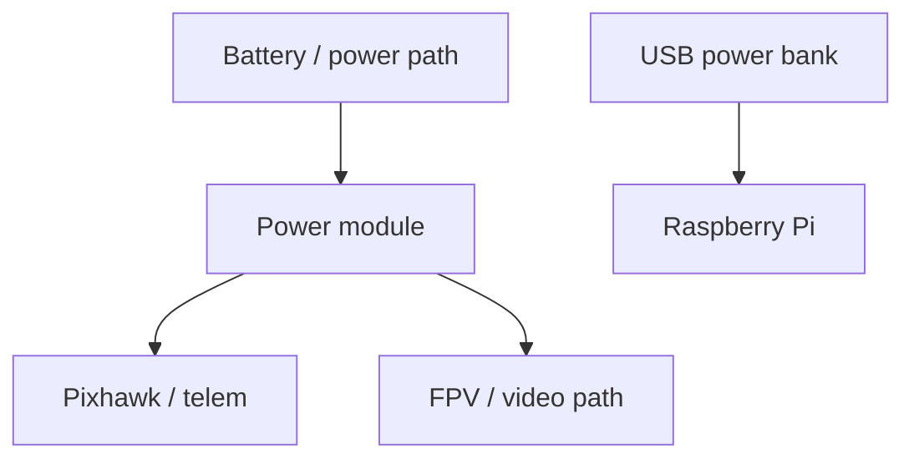

# Original Architecture

> Label for all diagrams: **Modern public reconstruction based on the original academic report.**

## Actors and components

- Operator / security personnel
- Mission Planner (ground tooling)
- Raspberry Pi companion computer
- Pixhawk flight controller
- GPS, motors/ESCs, FPV camera, telemetry radio
- Network monitoring tools and unnamed IDPS concept
- AWS Console / cloud concepts (services unspecified)
- Alert management concepts / operator interface mockups

## Trust boundaries (historical concept)

1. Operator device ↔ ground tools
2. Ground ↔ drone (telemetry / video)
3. Companion computer ↔ flight controller
4. Companion computer ↔ cloud
5. Companion computer ↔ monitored network concept

## Use case

## Data / control flow

## Component flow

## Operator interaction flow

## Alert-management flow

## Power-flow summary

## Known historical inconsistencies (not guess-resolved)

| Topic | Tension |
|-------|---------|
| Abstract vs conclusion | Abstract language vs incomplete deployment |
| Sensor design mentions | Some design text vs camera/GPS-centric hardware list |
| “Raspberry Pi API” | Named API but described as terminal CLI |
| AWS | Console named; services unnamed |
| Testing narrative | Passes coexist with explicit fails and inconclusive results |
